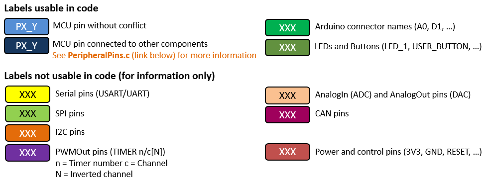

# Nucleo L053RB

## Specifications
- STM32L053R8T6 in LQFP64 package
- ARM®32-bit Cortex®-M0+ CPU
- 32 MHz max CPU frequency
- VDD from 1.65 V to 3.6 V
- 64 KB Flash
- 8 KB SRAM
- GPIO (51) with external interrupt capability
- 12-bit ADC with 16 channels
- 12-bit DAC with 1 channel
- RTC
- Timers (5)
- I2C (2)
- USART (3)
- SPI (2)
- USB 2.0 full-speed 

## Pinouts

